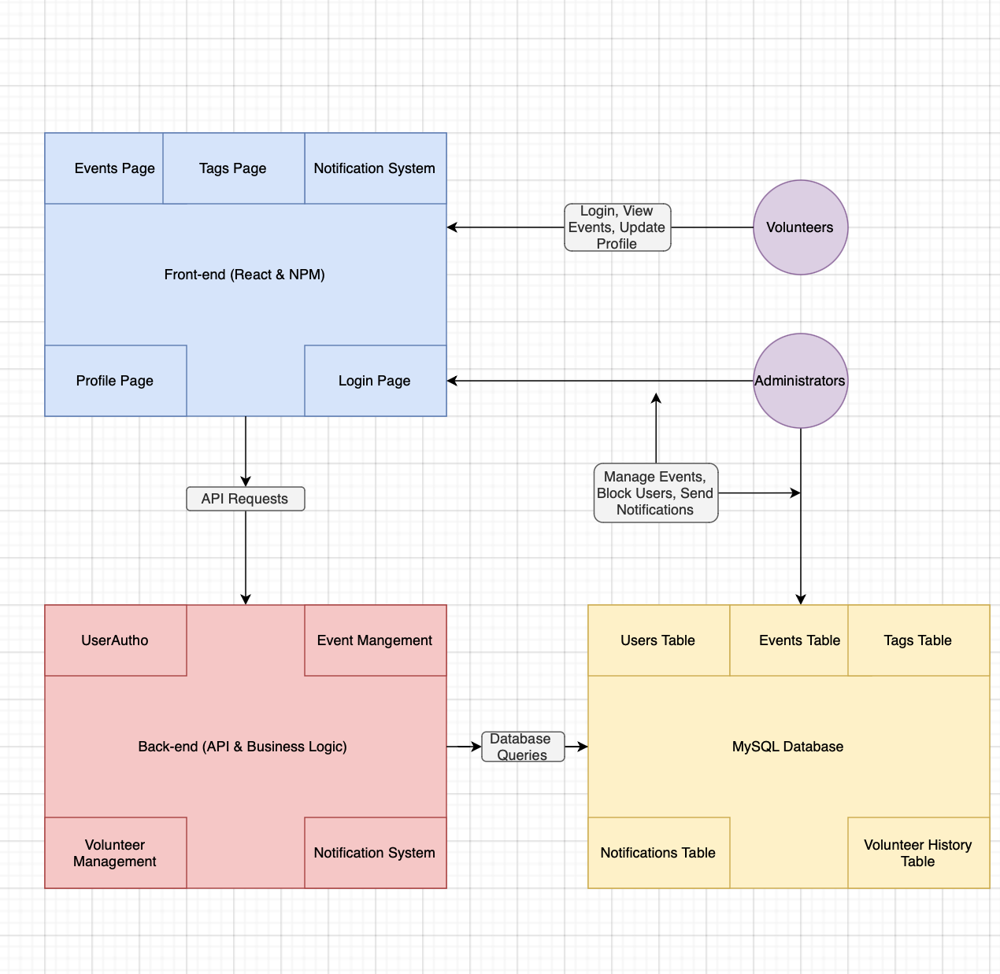

# cosc-4353-project
Volunteer Management Web App

## Initial Thoughts 

> Consider user experience: How will users (volunteers and administrators) interact with the application?
> 
> Identify the key functionalities: What are the essential features the application must have?

### Logging In / Registering
After accessing the site, both volunteers and administrators will share the same experience. They will be prompted to login via a login page to further access the site.
An option to register will be present if they do not have a login. During registration, new users will need to provide a username and password. Once these are entered,
they will be presented with an email field to verify their account.

### User Profile Management
Immediately after registering, new users will be sent to an identifier or "tag" page. This page will ask users to click on onscreen tags that identify their skills, preferences, and availability. When a user has finished, they will be prompted to enter their location as the final tag. The tag page will be optional, a tiny skip option will be present on the page's right hand corner. Should a user choose to skip the tag
page, their events page will only favor showing urgent or prioritized events.

Regardless of whether they skip or fill out the tag page, all new users will be sent to the events page (the main page).
Returning users are simply sent to the events page after logging in. 

### Event Management & Volunteer Matching 
The events page will use the tags of an individual to populate itself with relevant events. For example, a volunteer whose location is in Katy would get recommended more events in Katy. There will be a search bar at the top of the page so that users may find specific events. 

Clicking on any event will direct volunteers towards a page dedicated to that event. Descriptions, requirements, images and an enlist button will be present on this page. 

Using the events page, administrators will have the added ability to create, delete, and modify current events. The creation/modification process will allow admins to add/edit tags to attract relevant volunteers.
The administrator will also have the ability to add requirements to an event when creating/modifying. Requirements will serve as restrictions for who can join an event. For example, an event could rely on the volunteers being forklift certified. Should a volunteer who doesn't have the forklift certified tag try to join, the events page will notify the user that they don't meet the requirements via a pop-up. 

Beyond tagging, administrators will also be able to add/edit titles, descriptions, and images relating to an event.

### Notification System
On the web app's sidebar will be a notifications tab. It will glow whenever new notifications are present. Pressing the tab will bring users to the notifications page. This page will contain notices in the form of reminders, updates, and assignments for events. All notifications will also be sent as emails to users. 

### Volunteer History
The profile tab will be situated at the top of the web app's sidebar. Clicking this tab will take a user to their profile page. From this page, users will be able to update their tags and view their volunteering history. 

Administrators will have the ability to leave performance reviews on the profile pages of users. These reviews can only be seen by administrators. Should a user prove too troublesome, they will also have the option to disable an account from the profile page of the selected user. Disabled accounts lose their ability to enlist in events.

> Technology stack: What technologies might you use for front-end, back-end, database, and other components?

We are planning to use ReactJS for the front-end, Node.js for the back-end, MySQL for the database, and an email API to send notifications to users. We might use mailgun.

## Development Methodology

>Explain why you would choose a particular development methodology (e.g., Agile, Waterfall, DevOps).
>
>Discuss how this methodology will help manage the project effectively.

We chose to use Agile as our development methodology. Agile will help keep everyone organized and efficient so no two people end up working on the same thing while all of us work concurrently. Furthermore, Agile's sprints will help us manage the project more effectively by giving us weekly goals.

## High-Level Design / Architecture

### Main Components

**1. Front-end (ReactJS)**  
- Responsible for the user interface and user interactions.  
- Handles pages for login, registration, events, notifications, and user profiles.  
- Communicates with the back-end using RESTful APIs.  
- Sends and receives data to and from the back-end to update the UI dynamically.  
- Uses asynchronous calls to display real-time data such as event recommendations and volunteer notifications.  

**2. Back-end (Node.js)**  
- Manages the business logic of the application.  
- Exposes RESTful API endpoints for various features, including authentication, event management, and notifications.  
- Handles user authentication (login/register), data validation, and permission checks for admins and volunteers.  
- Communicates with the database to store and retrieve data.  
- Integrates third-party services, such as the Mailgun API, for sending notifications.  

**3. Database (MySQL)**  
- Stores and manages the application’s data, including:  
  - User accounts (volunteers and administrators).  
  - Events, tags, and event requirements.  
  - Volunteer history and performance reviews.  
  - Notifications and email logs.  
- Supports CRUD (Create, Read, Update, Delete) operations through SQL queries.  
- Maintains relational tables such as:  
  - `Users`: for storing usernames, passwords, and profile data.  
  - `Events`: for event details and tags.  
  - `Tags`: for skill and location identifiers.  
  - `Notifications`: for event updates and reminders.  

**4. Email API (Mailgun)**  
- Handles email notifications to users regarding important updates, reminders, and assignments.  
- When a significant action occurs (like an administrator creates a new event or a volunteer registers), the back-end triggers a request to the Mailgun API to send an email.  
- The email API uses predefined templates for various types of notifications.  

---

### Component Interaction

Below are examples of how different components interact:

#### Scenario 1: User Registration & Login  
1. The user accesses the login page on the front-end and enters their credentials.  
2. The front-end sends a POST request to the back-end API to handle the login.  
3. The back-end verifies the credentials by querying the `Users` table in the database.  
4. If the credentials are valid, the back-end responds with an authentication token, which the front-end uses to manage the session.  
5. The user is then redirected to the events page.  

#### Scenario 2: Volunteer Matching  
1. A logged-in user navigates to the events page.  
2. The front-end sends a GET request to the back-end to fetch events matching the user's tags (e.g., location and skills).  
3. The back-end queries the `Events` and `Tags` tables in the database.  
4. The back-end filters relevant events based on the user’s tags and sends the data to the front-end.  
5. The front-end dynamically displays the events on the page.  

#### Scenario 3: Event Creation & Notification  
1. An administrator creates a new event through the front-end.  
2. The front-end sends a POST request to the back-end with the event details.  
3. The back-end inserts the new event into the `Events` table in the database.  
4. The back-end triggers the Mailgun API to send notifications to relevant volunteers based on their tags.  
5. Volunteers receive email notifications and can view the event on the events page.  

---

### Integration Plan for Third-Party Services

We plan to integrate the following third-party service:

#### Mailgun API  
- **Purpose:** Send automated email notifications to users regarding event updates, reminders, and assignments.  
- **Integration Flow:**  
  1. The back-end Node.js server makes an HTTP request to Mailgun's API whenever an event-related action occurs (e.g., event creation).  
  2. The API request includes the email recipient, subject, body content, and any relevant tags or attachments.  
  3. Mailgun processes the request and sends the email to the user's inbox.

## Group Member Participation
| Group Member Name    | What is your contribution? | Discussion Notes |
| -------- | ------- | ------- |
| David | Created base project and organized content, worked on Initial Thoughts, Development Methodoligy, High-Level Design / Architecture quesitons | Created initial repository in GitHub, discussed, summarized, and finalized main points for each question, helped design user journey through website. |
| Ruk | Worked on Initial Thoughts, Development Methodoligy, High-Level Design / Architecture quesitons | Discussed and created main points for each question, helped design user journey through website.  Organized Group Member Participation table in README. |
| Iuri |  |  |
| Nathan |I contributed the high-level design and architecture section, including component descriptions, interaction scenarios, an integration plan for the Mailgun API, and an architecture diagram linked in the README.  | I contributed the high-level design and architecture section by detailing the main components (front-end, back-end, database, and Mailgun API), describing key interaction flows (registration, matching, notifications), and adding an architecture diagram linked in the README. |

+++ STILL IN PROGRESS

